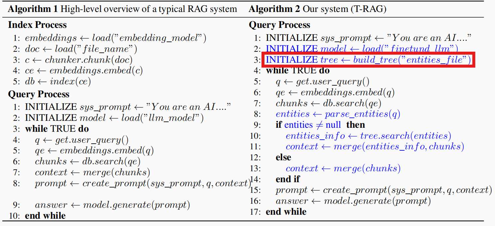

# T-RAG 树生成

## 项目根目录

`entities.csv`：存储所有必要实体信息（只作为查看用）

`entities_file.csv`：实体依赖关系（第一列依赖第二列）

`main.py`：函数使用示例

`entities_file_erect.py`：调用大模型查找实体关系

## trag_tree

### tree.py

本文件定义了`EntityTree`类：

* `__init__(root_entity, data)`：传入根对应实体名称和树枝集合，例如传入`('a', {('a', 'b'), ('b', 'c'), ('a', 'c')})`，树枝中节点顺序随意
* `set_bitset(hash_func)`：传入哈希函数，设置所有节点的数位（为`bloom filter`做准备）
* `get_root()`：获取根节点的`EntityNode`实例
* `print_tree()`：打印层级信息，调试用
* `bfs_search(entity)`：层次优先搜索`entity`（字符串）

### node.py

本文件定义了`EntityNode`类：

* `__init__(entity)`：传入`entity`（字符串），初始化节点
* `set_bitset(hash_func)`：传入哈希函数，设置所有节点的数位（为`bloom filter`做准备）
* `add_children(node)`：为节点添加子节点（`EntityNode`类）
* `get_children()`：获取子节点列表
* `get_parent()`：获取父节点
* `get_bitset()`：获取哈希结果
* `get_entity()`：获取节点存储实体信息

## entity

### ruler.py

* `enhance_spacy(entities)`：是原论文函数改写，传入自定义实体列表，返回`Spacy`的轻量级NLP
* `get_enhanced_nlp()`：打开`entities.csv`，加载自定义实体信息到NLP中，返回载入实体信息的NLP
* `search_entity_info(tree, nlp, search)`：是原论文函数改写，传入树、NLP、搜索信息（字符串），返回树节点列表（`EntityNode`类的列表）

### read.py

读取`pdf, doc, docx`的内容

### process.py

`Babelscape/rebel-large`模型使用，效果太差，现在已经弃用

## rel_llm

### chat.py

调用大模型进行关系提取